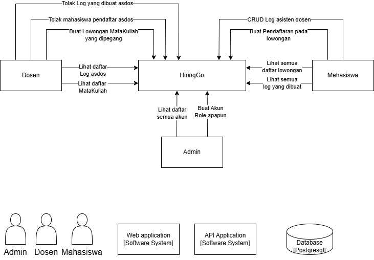
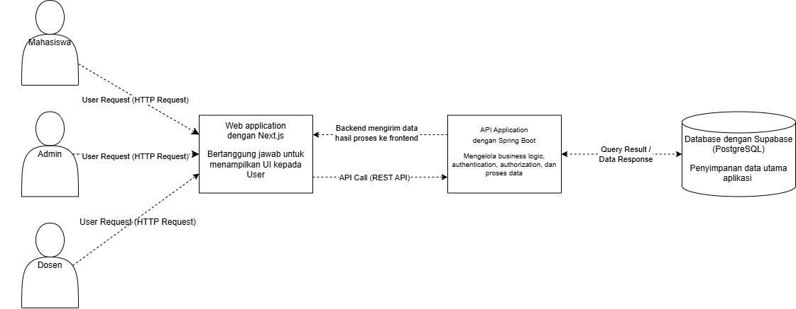
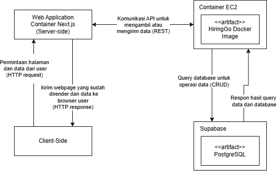
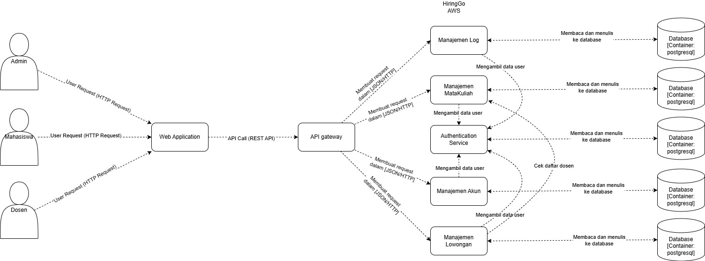
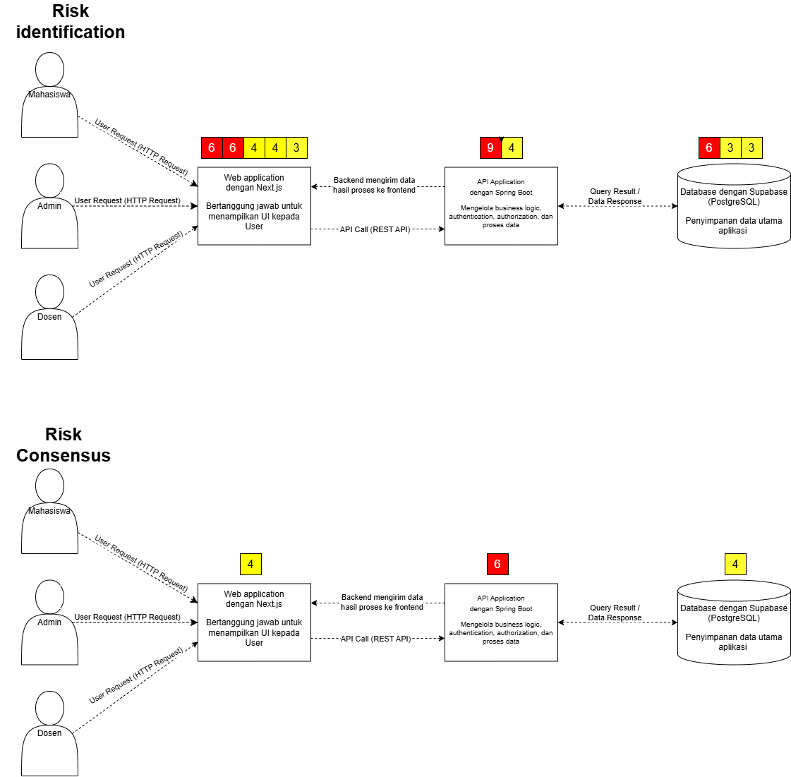
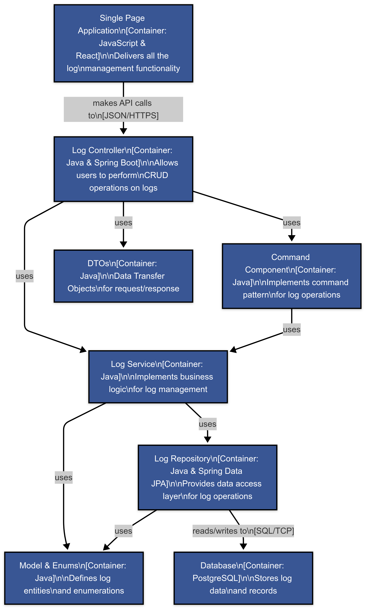
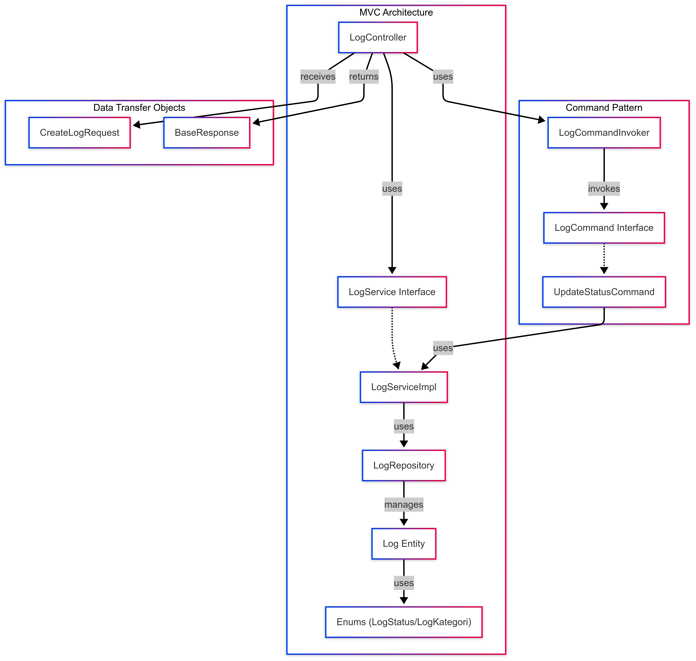
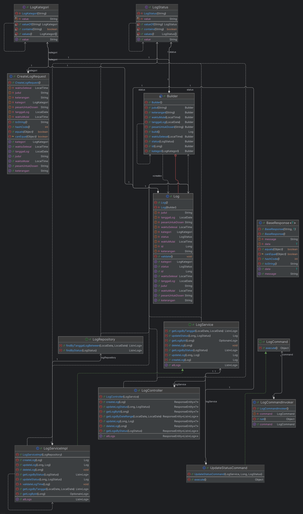

# AdvProg A13 HiringGo
## Deployment Link (aws dimatikan dulu karena sudah hampir kepakai semua dollarnya): https://hiringgo-a13.koyeb.app/
## Nama Anggota Kelompok A13
- Christian Raphael Heryanto (2306152323)
- Muhammad Radhiya Arshq (2306275885)
- Nobel Julian Bintang (2306202826)
- Christian Yudistira Hermawan (2306241676)
- Akmal Nabil Fikri (2306152084)
- Henry Aditya Kosasi (2306214990)

## Pembagian Tugas
1. Registrasi Akun (⛓️‍💥) (C, R) & Login  ⛓️‍💥 (C, R) [Authentication] **Bersama-sama**
2. Dashboard 🧑‍🏫/🧑‍🎓/🧑‍💻 & Mendaftar Lowongan 🧑‍🎓(C, R) **Christian Yudistira Hermawan**
3. Manajemen Akun 🧑‍💻(C, R, U, D) **Christian Raphael Heryanto**
4. Manajemen Mata Kuliah 🧑‍💻(C, R, U, D) **Muhammad Radhiya Arshq**
5. Manajemen Lowongan 🧑‍🏫 (C, R, U, D) **Henry Aditya Kosasi**
6. Manajemen Log 🧑‍🎓(C, R, U, D) **Nobel Julian Bintang**
7. Periksa Log 🧑‍🏫 (R, U) & Dashboard Honor 🧑‍🎓 **Akmal Nabil Fikri**

### Context Diagram

### Container Diagram

### Deployment Diagram

#### Future Architecture

#### Risk Storming Analysis

  
Berdasarkan identification yang kami lakukan dan consensus yang kami capai, ditemukan beberapa potensi risiko pada arsitektur sistem yang saat ini masih bersifat monolitik. Pada area pertama, yaitu Web Application yang dibangun menggunakan Next.js dan bertanggung jawab untuk menampilkan UI user, beberapa dari kami menyoroti adanya potensi celah keamanan terkait input pengguna yang tidak tervalidasi dengan baik. Risiko seperti Cross-Site Scripting (XSS) dan pengungkapan informasi internal aplikasi melalui tampilan error yang tidak dikonfigurasi secara tepat di lingkungan produksi menjadi sorotan utama. Konsensus menyatakan bahwa area ini memiliki tingkat risiko sedang (medium), dan adanya ketergantungan erat antara UI dan komponen backend juga memperbesar dampak ketika terjadi celah keamanan.
  
Pada area kedua, yaitu API Application yang menggunakan Spring Boot dan menangani logika bisnis, autentikasi, serta otorisasi, kami menilai adanya potensi risiko tinggi apabila pengelolaan otorisasi tidak dilakukan secara ketat. Ancaman seperti privilege escalation dapat terjadi, terlebih karena seluruh modul bisnis saat ini masih berada dalam satu aplikasi besar yang terintegrasi. Hal ini membuat satu celah di satu bagian bisa berdampak luas ke bagian lain. Risiko terkait autentikasi dan otorisasi yang salah konfigurasi, serta kurangnya isolasi antar domain fungsional, dipandang sebagai risiko tinggi (high).
  
Sementara itu, di area ketiga yaitu Database yang menggunakan Supabase (PostgreSQL), kami mengidentifikasi risiko terkait kurangnya segmentasi akses serta enkripsi data yang tidak menyeluruh. Kekhawatiran muncul terhadap kemungkinan akses langsung ke data sensitif oleh pihak yang tidak berwenang, terutama karena seluruh layanan menggunakan koneksi dan skema basis data yang sama. Walaupun database ini tidak secara langsung terekspos ke publik dan hanya diakses melalui API, tim menyepakati bahwa risikonya masih berada pada tingkat sedang (medium).
  
Sebagai langkah mitigasi terhadap risiko-risiko ini, kami menyadari perlunya perubahan arsitektur secara menyeluruh dari monolitik menuju pendekatan berbasis microservices. Dengan memisahkan Web Application, layanan otentikasi, logika bisnis, dan layanan database ke dalam service-service terpisah, kami dapat menerapkan kontrol keamanan yang lebih spesifik, meningkatkan isolasi antar modul, serta membatasi dampak jika salah satu komponen mengalami kegagalan atau diserang. Selain itu, pengelolaan akses, validasi input, serta konfigurasi produksi akan lebih terfokus dan terkontrol di setiap microservice. Namun, transisi ini tentu tidak tanpa risiko baru, kompleksitas dalam implementasinya, kebutuhan untuk observabilitas dan monitoring yang lebih canggih, serta potensi latency jaringan menjadi tantangan yang perlu dipertimbangkan dan dikelola dengan matang.
  

### Individual Diagram
### Nobel Julian Bintang
#### Component Diagram

#### Code Diagram
